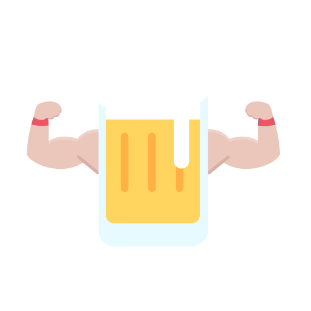

# Beercules




Welcome to **Beercules** app, an open-source drinking game developed in flutter. Available in the Apple App Store and on Google Play.

## 🚀 Features
- **Intuitive Design**: A user-friendly Drinking game. Easy to use. Hard to master
- **Cross-Platform Support**: Available on Android and iOS and Web.


## 📱 Download Now

Get **Beercules** on your device:

<div style="display: flex; gap: 10px;">
   <a href="https://play.google.com/store/apps/details?id=cc.zellner.beercules">
      
   </a>
   <a href="https://apps.apple.com/vn/app/beercules/id1469757352">
      
   </a>
</div>


## 🎨 App Screenshots

Explore **Beercules** through these visuals:

### **Screenshots**
<div style="display: flex; gap: 10px;">
   
   
   
</div>


## ✨ Contributing

I love contributions! Follow the steps below for creating new content for the app:

### New Card Process:
1. **Create an Image**: Use the [Microsoft AI Image Generator](https://create.microsoft.com/en-us/features/ai-image-generator).
2. **Remove Background**: Clean up the image with [Pixlr Express](https://pixlr.com/de/express/).
3. **Convert to Black/White SVG**: Transform the image using [Convertio](https://convertio.co/de/download/).
4. **Add Color**: Finalize your SVG with [PNG to SVG](https://www.pngtosvg.com/).


## 🛠️ Getting Started

1. Clone the repository:
   ```bash
   git clone https://github.com/yourusername/your-repo.git
   ```
2. Install dependencies:
   ```bash
   flutter pub get
   ```
3. Run the app locally:
   ```bash
   flutter run
   ```


## 💬 Community

Join the conversation and connect with other users and contributors:
- [GitHub Issues](https://github.com/yourusername/your-repo/issues)
- [Discord Server](#)


## 📝 License

This project is licensed under the [MIT License](LICENSE).


### Made with ❤️ by zelli